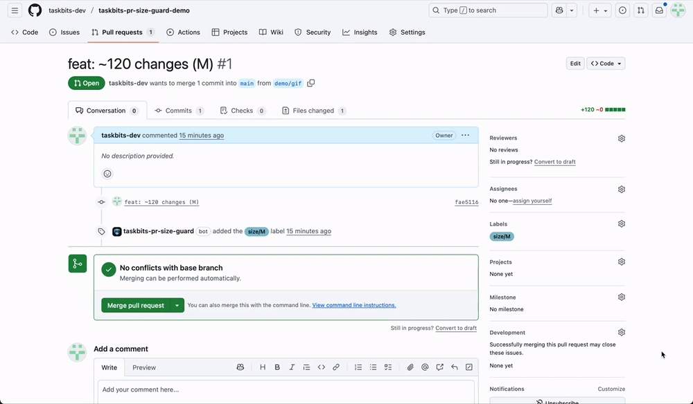

# Taskbits PR Size Guard — Docs

Auto-labels PR size (XS–XL) from additions+deletions. YAML config, ignores docs/locks/vendor, optional single comment for big PRs.

- **Docs:** https://taskbits.app/apps/taskbits-pr-size-guard#docs  
- **Support:** https://taskbits.app/support  
- **Privacy:** https://taskbits.app/privacy  
- **Terms:** https://taskbits.app/terms

See `examples/taskbits.yml` for config.

### 20s demo

